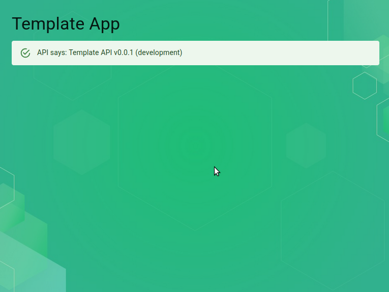

# React /w Zustand + Django Ninja Template

**React · Material UI · Zustand · Django Ninja · AWS ECS Fargate · Terraform**

[](https://github.com/WillSams/react-zustand-django-template/actions/workflows/pr-validate.yml)

A reusable full-stack template — React SPA frontend backed by a stateless Django Ninja REST API running on AWS ECS Fargate. Fork it, rename things, and ship.

This template uses **Zustand** for state management — the right fit when state needs to be shared across distant parts of the component tree without the boilerplate of Redux, or when you want a simple, scalable store with minimal setup. It deploys to **AWS ECS Fargate** behind an Application Load Balancer, which gives you persistent containers, predictable cold starts, and easier horizontal scaling compared to Lambda.

See also the [useReducer template](https://github.com/WillSams/react-usereducer-django-template) for a zero-dependency state approach, and the [Redux Toolkit template](https://github.com/WillSams/react-redux-django-template) for heavier state needs.



## Stack

| Layer | Tech |
|---|---|
| Frontend | React 18, Material UI, React Router, Axios, Zustand, Vite, Vitest |
| Backend | Python 3.9, Django 4.2, Django Ninja, uvicorn (ASGI server) |
| Infrastructure | Terraform — ECS Fargate, ALB, ECR, VPC, S3, CloudFront, IAM, CloudWatch |
| Quality | ESLint, Prettier, ruff, Husky pre-commit + pre-push, GitHub Actions CI |

## Overview

The backend is stateless — no database, no sessions. It runs as a containerised ASGI app via [uvicorn](https://www.uvicorn.org/) on ECS Fargate, behind an Application Load Balancer. You can develop locally using Django's built-in development server.

[Django Ninja](https://django-ninja.dev/) brings several advantages over a plain Django REST setup:

- **Automatic OpenAPI docs** — interactive Swagger UI generated from your code, no extra config needed
- **Type-safe request/response** — uses Python type hints and Pydantic for validation and serialisation
- **Fast and async-ready** — designed for high-throughput APIs with native async support
- **Schema-first development** — your function signatures define the contract, keeping code and docs in sync

The interactive API docs are available at `http://localhost:8080/docs` when running locally. Note: accessing via the Vite proxy at `localhost:3000/api/docs` loads the docs page but Swagger UI cannot fetch the schema through the proxy — use the direct backend URL instead.

## Prerequisites

- [Python 3.9](https://www.python.org/) — use pyenv to manage versions
- [Node.js 22](https://nodejs.org/) — use `nvm use` to pick the version in `.nvmrc`
- [pyenv](https://github.com/pyenv/pyenv) *(recommended)*
- [nvm](https://github.com/nvm-sh/nvm) *(recommended)*
- [direnv](https://direnv.net/) *(recommended)*
- [Terraform CLI](https://developer.hashicorp.com/terraform/install) — for infra changes
- [AWS CLI](https://aws.amazon.com/cli/) — for deployments

## Getting Started

```bash
# 1. Use the right Node version
nvm use

# 2. Create and activate a Python virtual environment
python -m venv .venv && source .venv/bin/activate

# 3. Install Python dependencies
pip install -r requirements-dev.txt

# 4. Set up environment variables
cp .envrc.example .envrc   # fill in values, then:
direnv allow

# 5. Install Node dependencies
npm install
cd frontend && npm install && cd ..

# 6. Start both services
npm run dev
```

The frontend is served at `http://localhost:3000` and the backend at `http://localhost:8080`.

## Project Structure

```text
react-zustand-django-template/
├── frontend/              # React SPA (deploys to S3 + CloudFront)
│   ├── src/
│   │   ├── api/           # Axios client
│   │   ├── stores/        # Zustand stores
│   │   └── pages/         # Route-level components
│   ├── specs/             # Vitest tests + setup
│   └── vite.config.ts
├── backend/               # Django Ninja API (deploys as Lambda)
│   ├── app/               # Django app (settings, urls, api)
│   └── specs/             # pytest tests
├── requirements.txt       # Python runtime dependencies
├── requirements-dev.txt   # Python dev dependencies (includes requirements.txt)
├── .infrastructure/       # Terraform
│   ├── api_gateway.tf
│   ├── frontend.tf
│   ├── lambda.tf
│   ├── iam.tf
│   ├── logs.tf
│   └── environments/      # demo / staging / prod tfvars
└── .github/
    └── workflows/         # CI: lint + test on every PR
```

## Scripts

From the project root:

| Command | Description |
|---|---|
| `npm run dev` | Start frontend + backend concurrently |
| `npm run dev:frontend` | Start frontend only |
| `npm run dev:backend` | Start backend only (port 8080) |
| `npm run test:frontend` | Run frontend tests |
| `npm run test:backend` | Run backend tests |
| `npm run test:frontend:coverage` | Frontend tests with coverage |
| `npm run test:backend:coverage` | Backend tests with coverage |
| `npm run lint:frontend` | Lint frontend |
| `npm run lint:backend` | Lint backend |
| `npm run format:frontend` | Format frontend |
| `npm run format:backend` | Format backend |
| `npm run clean` | Remove build artefacts and node_modules |

Backend commands (run from `backend/`):

```bash
ruff format app/ specs/                     # format
ruff check app/ specs/                      # lint
pytest                                      # test
pytest --cov=app --cov-report term          # test with coverage
```

## Development

Enable git hooks by running `pre-commit install --hook-type pre-commit --hook-type pre-push` from the project root.

**On every commit:** `ruff format` + `ruff check --fix`

**On every push:** `pytest`

## Infrastructure

The Terraform configuration in `.infrastructure/` provisions:

- **ECR Repository** — Docker image storage
- **VPC** — two public subnets across two AZs
- **ALB** — internet-facing Application Load Balancer
- **ECS Cluster + Fargate Service** — runs the Django-Ninja container via uvicorn
- **S3 bucket** for the React SPA (private, versioned)
- **CloudFront** distribution with OAC, HTTPS redirect, and SPA 404 fallback
- **IAM** — ECS task execution role + task role
- **CloudWatch** log group with configurable retention

```bash
cd .infrastructure

# Initialise (once)
terraform init

# Plan against an environment
terraform plan -var-file=environments/demo.tfvars -var "django_secret_key=<secret>"

# Apply
terraform apply -var-file=environments/demo.tfvars -var "django_secret_key=<secret>"
```

After the first apply, note the `alb_dns_name` output and set it as `ALLOWED_HOSTS` (and `allowed_origins` in your tfvars) before the next apply.

### Deploying the frontend

Set `VITE_API_URL` to your API Gateway URL at build time so the bundle points at the correct backend:

```bash
cd frontend
VITE_API_URL=http://<alb-dns-name>.elb.amazonaws.com npm run build
aws s3 sync dist/ s3://$(terraform -chdir=../.infrastructure output -raw s3_bucket) --delete
aws cloudfront create-invalidation \
  --distribution-id $(terraform -chdir=../.infrastructure output -raw cloudfront_distribution_id) \
  --paths "/*"
```

The CloudFront invalidation is required after each deploy so users receive the updated files rather than stale cached content.

### Production environment variables

Set these in your Lambda function's environment (or via Terraform `tfvars`):

| Variable | Dev default | Production value |
|---|---|---|
| `DJANGO_SECRET_KEY` | insecure dev key | A strong random secret |
| `DEBUG` | `True` | `False` (or unset) |
| `ALLOWED_HOSTS` | `*` | Your ALB DNS name (or custom domain) |
| `CORS_ALLOWED_ORIGINS` | `http://localhost:3000` | Your CloudFront domain (e.g. `https://app.yourdomain.com`) |
| `ABOUT_MESSAGE` | `Template API v0.0.1 (development)` | Your production value |

Set this at frontend build time (injected by Vite into the bundle):

| Variable | Dev | Production |
|---|---|---|
| `VITE_API_URL` | *(unset — uses Vite proxy)* | Your API Gateway URL |

### Deploying the backend

Three GitHub Actions workflows handle backend deployment — all triggered manually via `workflow_dispatch` with an environment choice (demo / staging / prod):

| Workflow | File | What it does |
|---|---|---|
| Build/Push Images to ECR | `push-images.yml` | Builds the Docker image and pushes to ECR only |
| Deployment (ECR, ECS) | `push-images-and-deploy-to-ecs.yml` | Builds, pushes, then forces a new ECS deployment |
| Re-deploy ECS | `redeploy.yml` | Forces a new ECS deployment without rebuilding the image |

Required repository secrets:

- `ACCOUNT_ID`
- `AWS_ACCESS_KEY_ID`
- `AWS_SECRET_ACCESS_KEY`

> **Note:** The ECS infrastructure (cluster, service, task definition) is not yet in `.infrastructure/`. The Terraform currently provisions Lambda + API Gateway. ECS Terraform is a planned addition for this template.
